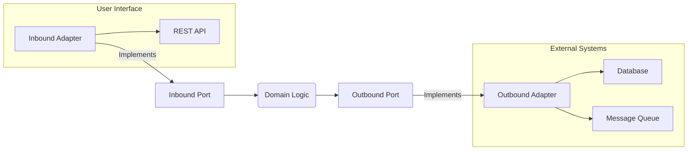

# hexagonal_go

This project demonstrates the Hexagonal Architecture (Ports and Adapters) pattern in Go. Hexagonal Architecture emphasizes the separation of concerns between the core business logic (the domain) and the outside world, which includes databases, user interfaces, and other systems.

## Architecture Overview

### Hexagonal Architecture: Ports and Adapters



# Key Concepts:

**Inbound Port:** Defines the interface for how the outside world (e.g., users or other systems) interacts with the core business logic.

**Outbound Port:** Defines the interface for how the core business logic interacts with external systems (e.g., databases, message queues).

**Driving Adapter:** Implements the Inbound Port, handling inputs (like HTTP requests) and invoking the domain logic.

**Driven Adapter:** Implements the Outbound Port, handling outputs (like saving data to a database) from the domain logic.

# Getting Started

**Clone the repository and run the project:**

```
git clone git@github-personal:trumboosahil/hexagonal_go.git
cd hexagonal_go
go mod tidy
go run main.go

```
